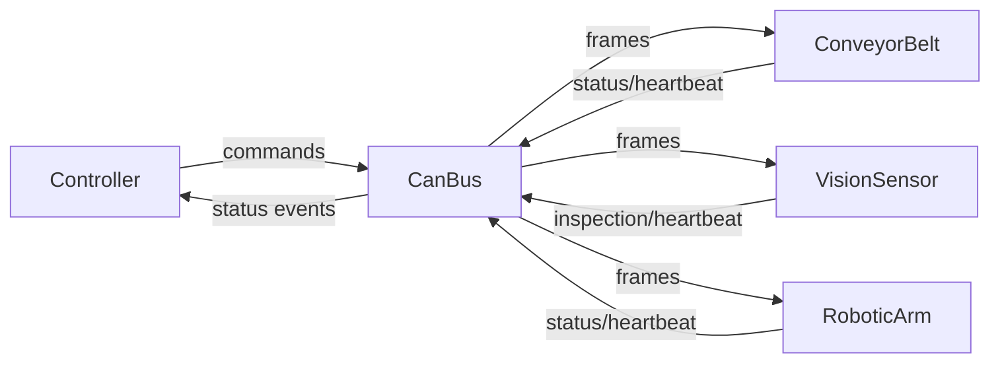

# CAN Device Simulation

Small embedded-style C++ simulation of a washer production line using a CAN-inspired bus.

It models:
- a `Controller`
- `ConveyorBelt`, `VisionSensor`, and `RoboticArm` devices
- bounded tick-based message processing over a shared `CanBus`
- heartbeat watchdogs and coordinated safety shutdown behavior

## How Image Classification Works

The `VisionSensor` uses a lightweight rule-based classifier (no trained ML model) implemented in
`src/vision_sensor.cpp`.

Pipeline overview:
- Load image as grayscale with `stb_image`, then downscale to max dimension 192 px for bounded cost.
- Compute an adaptive brightness threshold from image mean and standard deviation.
- Find the main bright connected component (candidate part) with flood-fill and bounding-box analysis.
- Sample circular regions inside that box:
  - center disc
  - annulus (ring around center)
- Derive hole-related features:
  - center brightness vs annulus brightness (contrast)
  - ratio of dark pixels in center
  - dark-mass distribution/concentration
- Combine those features with shape/aspect checks to decide:
  - `Valid` (washer-like ring with center hole)
  - `Invalid` (solid disc/non-washer)
  - `Unknown` (insufficient/conflicting signal)

The confidence-like `score` (0-100) is computed from these same features. In control flow,
`Invalid` and `Unknown` are both treated as reject for downstream handling.

## Build And Test

```bash
make main
make run-tests
```

Binary:
- `./build/main`

## Example Commands

### 1) Normal run (smooth profile)

```bash
./build/main --preset=smooth --max-ticks=50 --tick-interval-ms=0
```

Expected behavior:
- controller bootstraps (robot home + conveyor start)
- parts are inspected and either accepted (pick/place) or rejected (pick/remove)
- each completed run auto-restarts
- summary ends with `result: MAX_TICKS_REACHED` if tick budget is hit

### 2) Fault + operator continue

```bash
./build/main --preset=faulty --max-ticks=1000 --tick-interval-ms=0
```

Expected behavior:
- device faults happen more often
- controller enters fault and sends shutdown commands to all devices
- simulation pauses and prompts:
  - `continue` to restart devices/controller and resume
  - `quit` to stop

### 3) Timed run (real-time feeling)

```bash
./build/main --preset=realistic --max-ticks=20 --tick-interval-ms=1000
```

Expected behavior:
- one bounded simulation tick per second
- visible step-by-step progression in logs
- no full production run is collapsed into a single tick

## Architecture Flowchart



## ASCII Architecture

### 1) Topology

```text
                +------------------+
                |    Controller    |
                |  state machine   |
                +---------+--------+
                          |
                  CAN-like frames
                          |
                +---------v--------+
                |      CanBus      |
                | bounded pass/tick|
                +---+----------+---+
                /                \
    +--------------+           +--------------+
    | ConveyorBelt |  -------  | VisionSensor |
    +--------------+           +--------------+
              \                    /
               \                  /
                +----------------+
                |     Robot      |
                |      Arm       |
                +----------------+
```

### 2) Tick Lifecycle

```text
Tick N:
  [1] Controller processTick()
  [2] Bus processSinglePass()
  [3] Devices processTick()
  [4] Bus processSinglePass()
  [5] sleep(tick-interval-ms)
```

## Known Limitations

- Single-threaded simulation; no true concurrent device execution.
- Vision currently uses mock image input selection from local sample files.
- Timing is discrete ticks, not hard real-time scheduling.
- Device physics are abstracted; conveyor/robot motion is event-level, not kinematic.
- Console logging is human-readable but not a structured telemetry stream.
- Protocol is intentionally simple and not implementing full CAN arbitration/error frames.

## Developer Notes

- Main implementation: `src/`
- Public headers: `include/`
- Tests: `tests/`
- Protocol IDs are centralized in `include/can_protocol.hpp`
